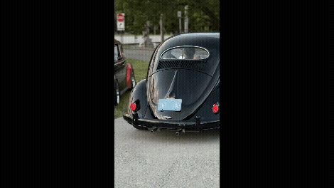

# Automatic License Plate Recognition (YOLOv8 + EasyOCR)



Real‑time license plate detection and reading. Uses **Ultralytics YOLOv8** for plate detection and **EasyOCR** to read the characters. Works with a webcam, video files, or single images. Saves crops and a CSV of recognized text + confidences.

---

## Features

* YOLOv8 plate detection (default weights: `yolov8n.pt` in repo)
* OCR on plate crops via EasyOCR (with configurable preprocessing)
* Works on **webcam**, **video**, or **image folders**
* Exports:

  * Annotated frames/video to `runs/detect/...`
  * Cropped plate images to `data/crops/` (if enabled)
  * `ocr_results.csv` with `timestamp, text, confidence, bbox`

---

## Repository structure

```
.
├─ data/                 # sample assets, demo GIF, optional crops/outputs
├─ runs/detect/          # YOLO/annotated outputs
├─ src/
│  ├─ detector.py        # PlateDetector (YOLOv8 wrapper)
│  ├─ ocr_utils.py       # EasyOCR init + preprocessing + helpers
│  ├─ infer_webcam.py    # CLI/entrypoint to run on webcam/video/images
│  └─ utils.py           # drawing, CSV writer, timing, etc.
├─ tests/                # unit tests (pytest)
├─ requirements.txt      # Python dependencies
└─ yolov8n.pt            # default YOLOv8n weights (small, fast)
```

---

## Quickstart

> Tested on Python **3.10–3.12**. A fresh virtualenv is recommended.

```bash
# 1) Clone
git clone https://github.com/Akart13/Automatic-License-Plate-Recognition.git
cd Automatic-License-Plate-Recognition

# 2) Create & activate venv
python -m venv .venv
source .venv/bin/activate            # Windows: .venv\Scripts\activate

# 3) Install deps
python -m pip install --upgrade pip
pip install -r requirements.txt
```

On first run, **EasyOCR** will download models (one‑time). If your network is restricted, run once with an internet connection.

---

## How to run

### A) From the command line

Common patterns (adjust to your setup):

```bash
# Webcam (device 0)
python src/infer_webcam.py --source 0

# Single image
python src/infer_webcam.py --source data/sample.jpg

# Video file
python src/infer_webcam.py --source data/sample.mp4

# Optional knobs (if present in your script)
#   --conf 0.80            # detection confidence threshold
#   --imgsz 1280           # inference image size
#   --save-video out.mp4   # write annotated video
#   --save-crops           # write cropped plate images
```

> If your local `infer_webcam.py` exposes different flag names, run:
> `python src/infer_webcam.py -h` to see the exact options in your copy.

### B) From Python

```python
from src.detector import PlateDetector
import cv2

cap = cv2.VideoCapture("data/sample.mp4")  # or 0 for webcam
model = PlateDetector(weights="yolov8n.pt", device="cpu", imgsz=1280, conf=0.80)

while True:
    ok, frame = cap.read()
    if not ok:
        break
    # model.predict(frame) should return YOLO results you can iterate over
    # (See src/infer_webcam.py for full end-to-end OCR & CSV saving example)
```

---

## Output

* **Annotated frames/video** → `runs/detect/...`
* **OCR crops** (if enabled) → `data/crops/`
* **CSV** (recognized text) → e.g. `data/ocr_results.csv`

The console will print recognized text and where files are written.

---

## Configuration

Most tuning lives in `src/ocr_utils.py` and `src/infer_webcam.py`:

* **Detection**: confidence (`conf`), image size (`imgsz`).
* **Crop tightening**: `shrink_x / shrink_y` (horizontal/vertical crop tighten). A typical default is small (e.g., `shrink_x = 0.06`).
* **OCR preprocessing**: grayscale → equalize → blur → threshold. You can tweak the manual threshold constant to increase plate contrast.

Tip: Bigger `imgsz` can improve recall but will be slower. Increase `conf` to reduce false positives.

---

## Tips for better OCR

* Aim for **sharp plates** with good contrast; avoid motion blur.
* Ensure the plate occupies a reasonable portion of the frame.
* Night scenes: try lowering the manual threshold or increasing exposure.
* Consider enabling multi‑try OCR with slightly different crops/thresholds and picking the best regex‑validated read.

---

## Troubleshooting

* **EasyOCR model download stalls** → run once with internet; ensure `easyocr` can write its cache (usually `~/.EasyOCR`).
* **No text printed** → confirm the plate bbox is correct; try loosening `conf` and enlarging `imgsz`; increase crop contrast.
* **OpenCV errors** → check that your Python + `opencv-python` wheels match your OS and Python version.

---

## Tests

```bash
pytest -q
```

---

## Roadmap (ideas)

* Character‑level language model to correct OCR errors
* Multi‑frame majority vote across a tracked plate
* Optional LLM‑based OCR fallback (separate branch)
* Simple labeling tool + active learning

---

## Acknowledgements

* [Ultralytics YOLOv8](https://github.com/ultralytics/ultralytics)
* [EasyOCR](https://github.com/JaidedAI/EasyOCR)

---

## License

This project is for educational/research use. Add a license file if you plan to distribute binaries or models.
